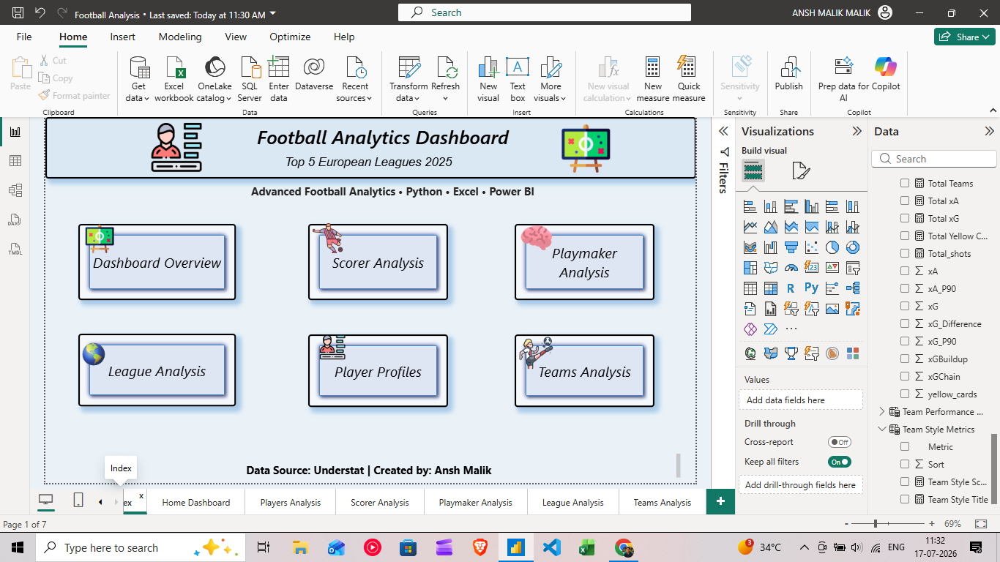
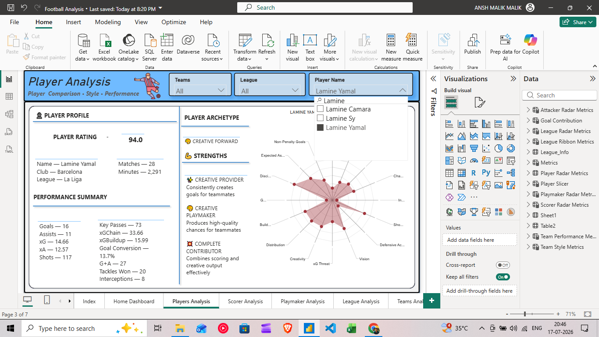
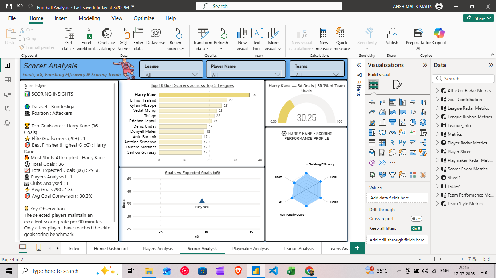
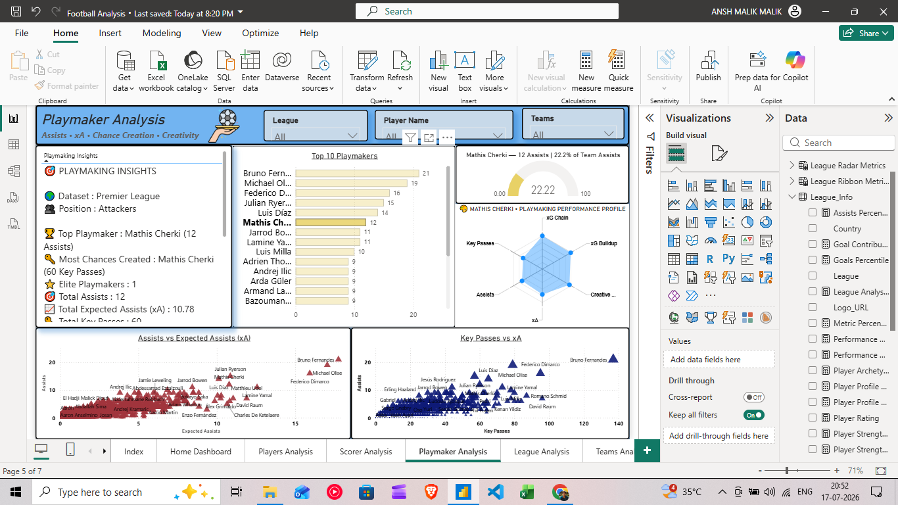
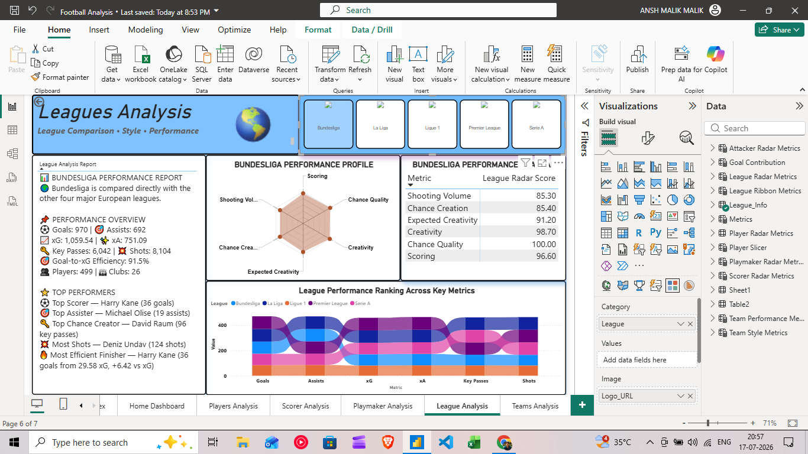
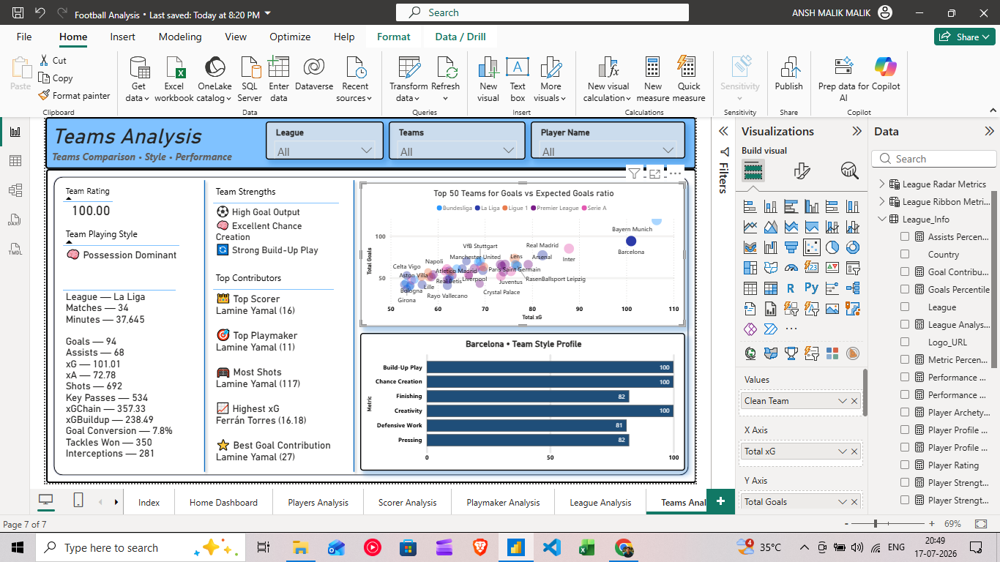

# ⚽ Football Analytics Dashboard | Power BI

An interactive Football Analytics Dashboard built using **Power BI, DAX, Python, Excel, and Google Colab** to analyze player, team, and league performance across the **Top 5 European Football Leagues (2024/25 Season).**

---

## 📖 Project Overview

This project transforms football data into an interactive Power BI dashboard that provides valuable insights into player, team, and league performance.

The dashboard includes:

- 👤 Player Analysis
- ⚽ Scorer Analysis
- 🎯 Playmaker Analysis
- 🏟️ Team Analysis
- 🌍 League Analysis
- 📊 Interactive KPIs & Visualizations

---

## 🛠️ Tools & Technologies

- Power BI
- DAX
- Power Query
- Microsoft Excel
- Python (Pandas & NumPy)
- Google Colab

---

## 📈 Football Metrics

- Goals
- Assists
- Expected Goals (xG)
- Expected Assists (xA)
- Goal Conversion %
- Key Passes
- xGChain
- xGBuildup
- Tackles Won
- Interceptions
- Shots
- Minutes Played

---

## 📂 Repository Structure

```text
Football-Analytics-Dashboard-PowerBI
│
├── Dashboard
│   └── Football_Analytics_Dashboard.pbix
│
├── Dataset
│   └── Cleaned_Dataset.xlsx
│
├── Python
│   ├── Data_Extraction.ipynb
│   └── Data_Cleaning.ipynb
│
├── Gallery
│   ├── Home_Dashboard.png
│   ├── Player_Analysis.png
│   ├── Playmaker_Analysis.png
│   ├── Scorer_Analysis.png
│   ├── League_Analysis.png
│   └── Team_Analysis.png
│
├── Documentation
│
├── README.md
└── LICENSE
```

---

# 📷 Dashboard Gallery

<p align="center">
  
  
</p>

<p align="center">
  
  
</p>

<p align="center">
  
  
</p>

---

## 🚀 Key Features

- Interactive dashboard with slicers
- Dynamic DAX measures
- Player performance profiling
- Scorer and playmaker comparison
- Team tactical analysis
- League comparison dashboard
- KPI cards and advanced visualizations

---

## 📊 Data Source

- Understat (Top 5 European Leagues – 2024/25)
- Data cleaned and transformed using Python and Excel.

---

## 📌 Future Improvements

- Passing Network Analysis
- Shot Maps
- Player Similarity Model
- Team Comparison Dashboard
- Predictive Analytics using Machine Learning

---

## 👨‍💻 Author

**Ansh Malik**

If you found this project useful, please consider giving it a ⭐ on GitHub.
